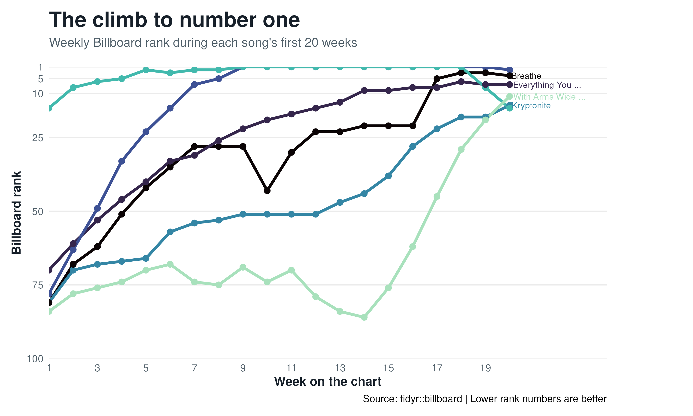

```{r}
#| message: false
library(tidyverse)
library(knitr)
```

This bump chart follows six songs through their first 20 weeks on the Billboard
Hot 100. Because a smaller rank is better, the vertical axis is reversed so a
song moving upward on the graphic is climbing the chart.

```{r}
#| message: false
#| fig-width: 10
#| fig-height: 6


```